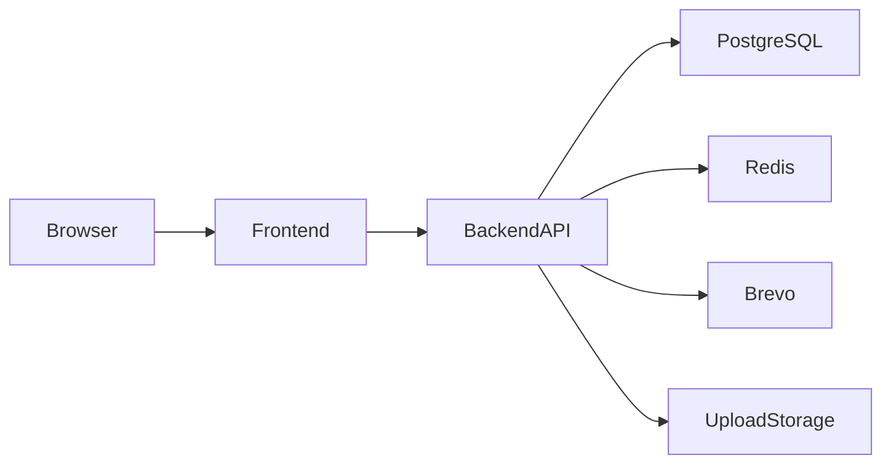
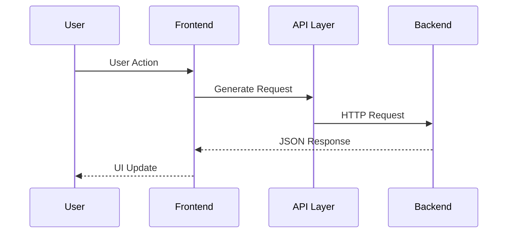
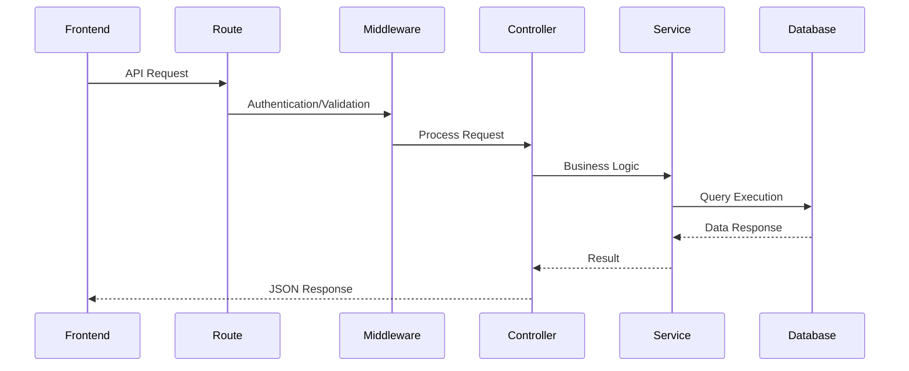
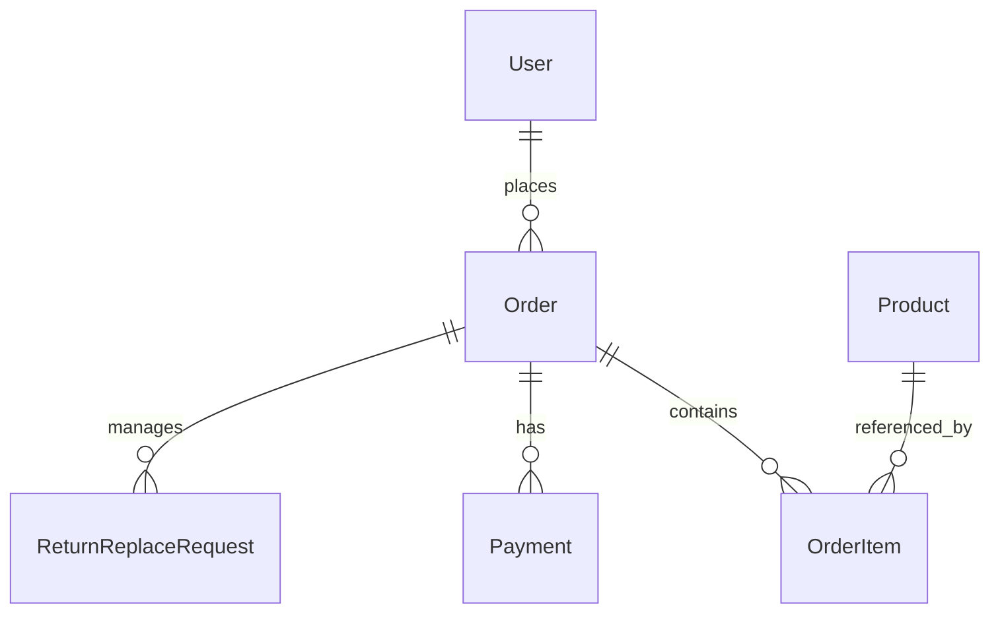
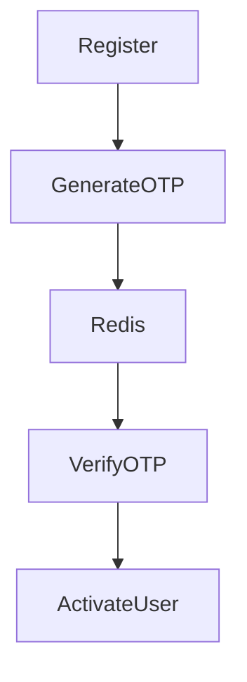
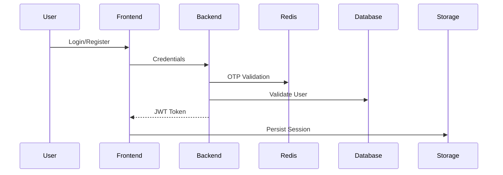
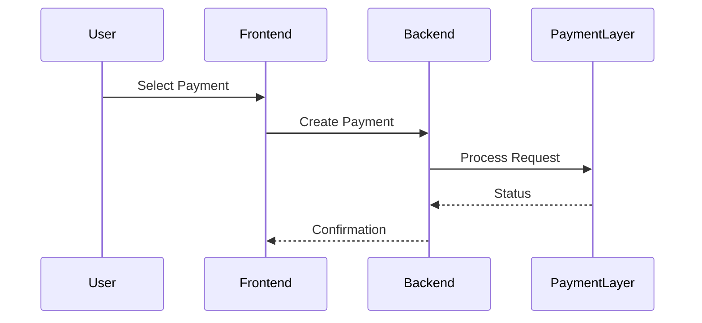
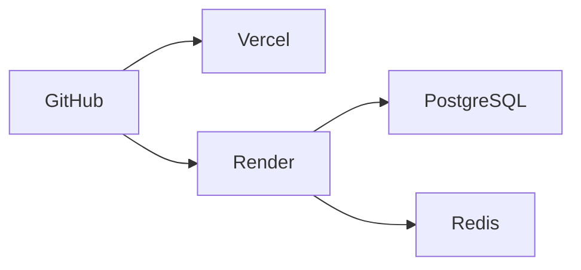

# SmartShop — Architecture Documentation

> Enterprise‑style architecture documentation for SmartShop full‑stack e‑commerce platform.

---

# Table of Contents

1. Architecture Overview
2. System Design Goals
3. Monorepo Architecture
4. High‑Level System Architecture
5. Frontend Architecture
6. Backend Architecture
7. Database Architecture
8. Redis Architecture
9. Authentication Architecture
10. Payment Architecture
11. Checkout Architecture
12. Order Lifecycle Architecture
13. API Architecture
14. Request Lifecycle
15. Frontend State Management
16. File Upload Architecture
17. Deployment Architecture
18. Scalability Strategy
19. Security Architecture
20. Performance Architecture
21. Folder Structure Architecture
22. Engineering Design Patterns
23. Reliability & Resilience Strategy
24. Future Architecture Evolution
25. Conclusion

---

# 1. Architecture Overview

SmartShop is a production‑inspired enterprise e‑commerce platform designed using scalable full‑stack architecture principles.

The platform combines:

- modern frontend engineering
- modular backend architecture
- relational database modeling
- Redis‑based security systems
- payment abstraction workflows
- transactional order management
- scalable API design
- deployment‑ready infrastructure

The system is intentionally structured to simulate real commercial e‑commerce architecture instead of a simple CRUD application.

---

# 2. System Design Goals

The architecture was designed with the following engineering goals:

| Goal | Purpose |
|---|---|
| Scalability | Support future feature growth |
| Maintainability | Simplify long‑term development |
| Modularity | Separate responsibilities clearly |
| Security | Protect users and transactions |
| Reliability | Reduce inconsistent system states |
| Reusability | Reuse business logic efficiently |
| Extensibility | Enable future service expansion |
| Performance | Handle large catalog operations efficiently |

---

# 3. Monorepo Architecture

SmartShop follows a monorepo architecture.

```text
apps/
  backend/
  frontend/
```

## Why Monorepo?

Advantages:

- centralized codebase management
- unified engineering standards
- simplified dependency management
- easier frontend/backend coordination
- shared documentation strategy
- simplified deployment workflows

---

# 4. High‑Level System Architecture



---

# System Components

## Frontend

Responsible for:

- UI rendering
- user interactions
- authentication persistence
- checkout orchestration
- API communication
- cart & wishlist management

## Backend API

Responsible for:

- business logic
- authentication
- payment workflows
- order workflows
- Redis security workflows
- database communication

## PostgreSQL Database

Responsible for:

- persistent storage
- relational data integrity
- transactional workflows
- product catalog storage
- order management

## Redis

Responsible for:

- OTP storage
- rate limiting
- temporary verification sessions
- login abuse prevention

## Brevo Email Service

Responsible for:

- OTP delivery
- password reset emails
- transactional communication

---

# 5. Frontend Architecture

The frontend is built using Next.js App Router architecture.

## Frontend Goals

- reusable UI architecture
- scalable route organization
- resilient checkout workflows
- centralized state management
- responsive user experience
- modular component design

---

# Frontend Layers

## App Router Layer

Handles:

- page routing
- nested layouts
- route organization
- scalable navigation

## Component Layer

Responsible for:

- reusable UI elements
- isolated rendering logic
- responsive design
- modular frontend composition

## Context Layer

Global providers manage:

- authentication state
- cart state
- wishlist state
- shop state

## API Layer

Responsible for:

- backend communication
- token injection
- authentication validation
- error handling

---

# Frontend Request Flow



---

# Frontend Resilience Architecture

The frontend includes defensive workflows for:

- expired JWT tokens
- invalid product references
- stale frontend state
- inconsistent API responses
- payment synchronization
- checkout validation

This improves runtime stability and transactional consistency.

---

# 6. Backend Architecture

The backend uses Express + TypeScript with modular layered architecture.

---

# Backend Layers

```text
routes/
controllers/
services/
middlewares/
lib/
prisma/
```

---

## Route Layer

Responsibilities:

- endpoint definitions
- middleware registration
- request routing
- API modularization

---

## Controller Layer

Responsibilities:

- request orchestration
- validation coordination
- service communication
- response formatting

---

## Service Layer

Responsibilities:

- reusable business logic
- payment workflows
- email workflows
- Redis operations
- transactional logic

---

## Middleware Layer

Responsibilities:

- authentication validation
- request preprocessing
- upload handling
- centralized error handling

---

## Infrastructure Layer

Infrastructure helpers include:

- Prisma clients
- Redis helpers
- payment abstraction
- environment utilities

---

# Backend Request Lifecycle



---

# 7. Database Architecture

SmartShop uses PostgreSQL with Prisma ORM.

## Database Goals

- relational consistency
- scalable querying
- transactional reliability
- normalized modeling
- future scalability

---

# Core Entities

| Entity | Purpose |
|---|---|
| User | Authentication & profiles |
| Product | Product catalog |
| Order | Order management |
| OrderItem | Product snapshots |
| Payment | Payment tracking |
| ReturnReplaceRequest | Return workflows |

---

# Entity Relationship Architecture



---

# Prisma ORM Architecture

Prisma provides:

- typed database access
- migration management
- relational querying
- schema consistency
- simplified database operations

---

# 8. Redis Architecture

Redis powers multiple security‑critical workflows.

## Redis Responsibilities

- OTP storage
- OTP expiration
- request throttling
- brute force prevention
- login abuse protection
- temporary verification sessions

---

# Redis Workflow



---

# Why Redis?

Redis was selected because it provides:

- high‑speed temporary storage
- native expiration handling
- efficient counters
- scalable rate limiting
- lightweight verification sessions

---

# 9. Authentication Architecture

Authentication uses JWT‑based session management.

---

# Authentication Features

- secure login
- OTP verification
- protected routes
- JWT token generation
- password hashing
- password reset workflows

---

# Authentication Flow



---

# Security Architecture

Security workflows include:

- JWT authentication
- bcrypt password hashing
- Redis rate limiting
- OTP expiration
- login throttling
- request validation
- protected APIs

---

# 10. Payment Architecture

SmartShop uses a payment abstraction architecture.

---

# Payment Goals

- gateway isolation
- transactional consistency
- refund handling
- payment state management
- realistic payment simulation

---

# Supported Payment Methods

- Card Payments
- UPI Payments
- Cash On Delivery

---

# Payment Flow



---

# Payment Features

- idempotency support
- payment polling
- confirmation handling
- refund workflows
- cancellation workflows
- status synchronization

---

# 11. Checkout Architecture

The checkout workflow is intentionally defensive.

---

# Checkout Workflow

```text
Create Temporary Order
→ Start Payment
→ Confirm Payment
→ Validate Products
→ Create Final Order
→ Link Payment State
```

---

# Checkout Goals

- reduce invalid orders
- synchronize payment state
- validate product existence
- improve transaction reliability
- handle stale frontend state

---

# Product Reconciliation Logic

The frontend performs:

- product ID validation
- product name matching
- brand matching
- fallback matching strategies

This improves checkout resilience.

---

# 12. Order Lifecycle Architecture

SmartShop includes automated order progression.

---

# Order Lifecycle

```text
Order Placed
   ↓
Order Packed
   ↓
Order Shipped
   ↓
Order Delivered
```

---

# Time‑Based APIs

Separate APIs handle:

- order status updates
- delivery progression
- payment synchronization
- refund synchronization

---

# Payment Synchronization

## Prepaid Orders

For Card/UPI:

```text
Payment Status = Paid
```

## COD Orders

```text
Order Created
→ Payment Pending
→ Order Delivered
→ Payment Paid
```

---

# Refund Architecture

If prepaid order is:

- cancelled
- returned

Then:

```text
Payment Status → Refund
```

---

# 13. API Architecture

The backend exposes REST APIs.

---

# API Modules

| Module | Route |
|---|---|
| Authentication | /api/auth |
| Products | /api/products |
| Orders | /api/orders |
| Payments | /api/payments |
| User | /api/user |

---

# API Design Principles

- modular routing
- predictable JSON responses
- scalable endpoint grouping
- reusable validation
- clean separation of concerns

---

# API Efficiency Features

- paginated responses
- filtered querying
- search suggestions
- modular endpoints
- reusable response patterns

---

# 14. Request Lifecycle

## Frontend Lifecycle

```text
User Action
→ API Request
→ Token Injection
→ Backend Validation
→ Database Query
→ JSON Response
→ UI Rendering
```

---

## Backend Lifecycle

```text
Request
→ Route
→ Middleware
→ Authentication
→ Validation
→ Service Logic
→ Database Query
→ Response
```

---

# 15. Frontend State Management

The frontend uses provider‑based global state architecture.

---

# Managed State Domains

- authentication
- cart
- wishlist
- shop state

---

# State Goals

- centralized state management
- predictable rendering
- reusable logic
- scalable architecture

---

# 16. File Upload Architecture

Avatar uploads are handled using multer.

---

# Upload Flow

```text
Frontend Upload
→ Multipart Request
→ Multer Middleware
→ Upload Storage
→ Avatar URL Response
```

---

# Upload Goals

- scalable upload handling
- separated file storage
- efficient asset serving
- profile image persistence

---

# 17. Deployment Architecture

## Frontend Deployment

Hosted on Vercel.

Benefits:

- optimized Next.js hosting
- CDN support
- fast frontend delivery

---

## Backend Deployment

Hosted on Render.

Benefits:

- PostgreSQL integration
- environment management
- deployment automation
- scalable backend hosting

---

# Deployment Flow



---

# 18. Scalability Strategy

The architecture is intentionally designed for future scalability.

---

# Scalability Goals

- modular backend growth
- frontend component scaling
- future microservice extraction
- reusable business logic
- scalable database modeling

---

# Future Microservice Readiness

Current architecture already separates:

- authentication
- payments
- orders
- products
- user management

This simplifies future service extraction.

---

# 19. Security Architecture

## Security Layers

| Layer | Purpose |
|---|---|
| JWT | Authentication |
| bcrypt | Password hashing |
| Redis | OTP & rate limiting |
| Middleware | Protected routes |
| Validation | Request security |

---

# Security Goals

- account protection
- abuse prevention
- transaction safety
- API protection
- authentication integrity

---

# 20. Performance Architecture

## Performance Goals

- scalable product browsing
- optimized rendering
- reduced payload size
- efficient database queries
- fast OTP verification

---

# Performance Strategies

## Pagination

Prevents loading massive product datasets.

## Defensive Rendering

Prevents frontend crashes from invalid state.

## Redis Optimization

Improves OTP and throttling performance.

## Modular APIs

Improves maintainability and scalability.

---

# 21. Folder Structure Architecture

## Backend

```text
apps/backend/
  src/
    routes/
    controllers/
    services/
    middlewares/
    lib/
```

---

## Frontend

```text
apps/frontend/
  app/
  components/
  contexts/
  lib/
  config/
```

---

# Folder Design Goals

- modular organization
- separation of concerns
- scalability
- maintainability
- engineering clarity

---

# 22. Engineering Design Patterns

## Patterns Used

| Pattern | Purpose |
|---|---|
| Service Layer | Reusable business logic |
| Middleware Pattern | Request interception |
| Provider Pattern | Frontend global state |
| Payment Abstraction | Gateway isolation |
| Modular Routing | API scalability |

---

# 23. Reliability & Resilience Strategy

SmartShop includes multiple defensive engineering workflows.

---

# Reliability Features

- payment synchronization
- product reconciliation
- token expiration handling
- OTP expiration handling
- request throttling
- refund synchronization
- defensive rendering

---

# Frontend Resilience

Frontend handles:

- expired sessions
- stale state
- inconsistent APIs
- payment polling
- invalid products

---

# Backend Reliability

Backend handles:

- centralized errors
- protected APIs
- validation workflows
- modular business logic
- transactional state handling

---

# 24. Future Architecture Evolution

Potential future architecture upgrades:

- Docker support
- Kubernetes deployment
- microservices
- queue systems
- distributed caching
- centralized logging
- observability platforms
- analytics systems
- event‑driven architecture

---

# 25. Conclusion

SmartShop demonstrates enterprise‑style full‑stack architecture with:

- scalable frontend engineering
- modular backend systems
- Redis security workflows
- payment abstraction architecture
- transactional checkout logic
- automated order lifecycle management
- relational database modeling
- deployment‑ready infrastructure

The project showcases production‑inspired engineering principles and demonstrates system design thinking far beyond a standard CRUD application.

SmartShop s