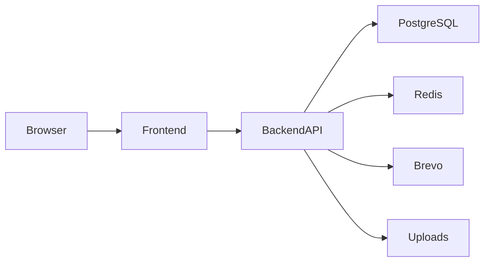
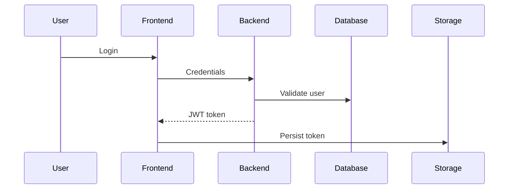
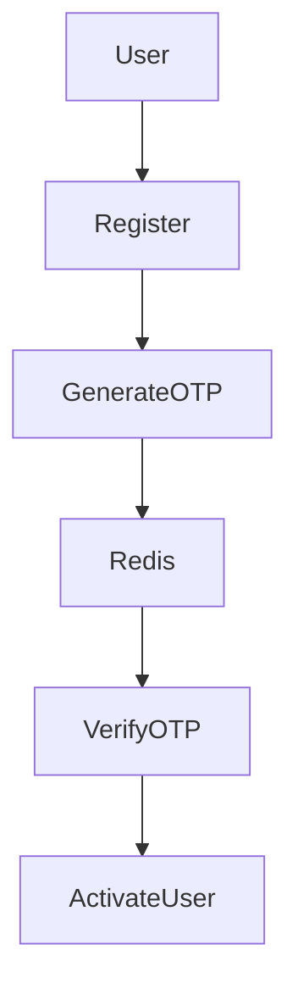
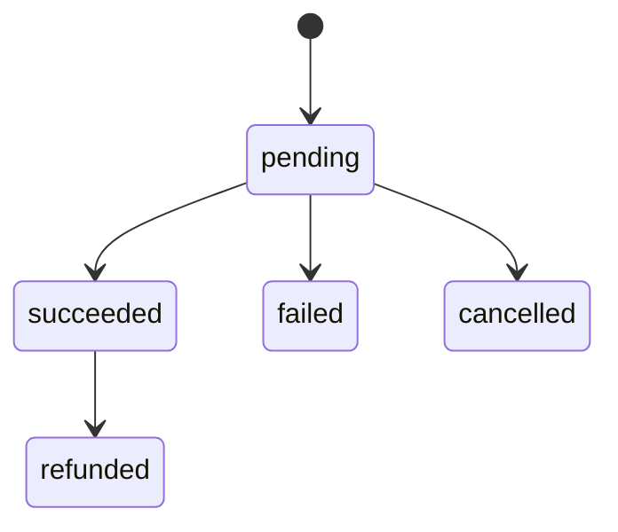
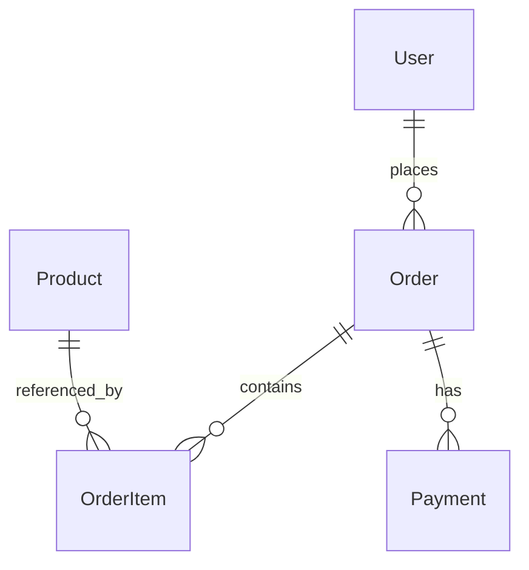

# SmartShop — Enterprise Full‑Stack E‑Commerce Platform

> Production‑style full‑stack e‑commerce platform built with modern frontend, backend, database, authentication, payment abstraction, OTP security, and scalable engineering architecture.

---

# Table of Contents

1. Executive Summary
2. Project Vision
3. Business Goals
4. Core Features
5. Enterprise Engineering Goals
6. Monorepo Architecture
7. System Architecture
8. Technology Stack
9. Frontend Architecture
10. Backend Architecture
11. Database Architecture
12. Authentication & Security
13. OTP + Redis Architecture
14. Payment Architecture
15. Checkout Architecture
16. Product Catalog System
17. Order Management System
18. Return & Replace Workflow
19. File Upload System
20. API Architecture
21. Frontend State Management
22. Request Lifecycle
23. Error Handling Strategy
24. Environment Management
25. Folder Structure Deep Dive
26. Prisma Data Model
27. Engineering Design Patterns
28. Scalability Strategy
29. Performance Optimization
30. CI/CD & Deployment
31. Logging & Monitoring
32. Security Practices
33. Local Development Setup
34. Testing Strategy
35. Technical Debt & Known Drift
36. Recruiter‑Focused Engineering Highlights
37. Future Enhancements
38. Conclusion

---

# 1. Executive Summary

SmartShop is an enterprise‑style full‑stack e‑commerce platform designed to simulate real‑world production engineering practices using a scalable monorepo architecture.

The project combines:

- Modern frontend architecture
- REST API backend
- PostgreSQL relational database
- Redis‑based OTP & security workflows
- Payment abstraction layer
- Authentication & authorization
- Transactional email workflows
- File uploads
- Order management
- Return/replace systems
- Production deployment workflows
- Enterprise‑style modular architecture

The platform is intentionally engineered to demonstrate:

- scalable software architecture
- maintainability
- modular engineering
- clean API design
- enterprise‑style backend patterns
- frontend resilience
- defensive programming
- production deployment awareness
- advanced SDET/system design understanding

---

# 2. Project Vision

The SmartShop platform was architected with the mindset of building a production‑grade e‑commerce ecosystem rather than a small CRUD application.

The core vision includes:

## Scalability

The architecture is designed so that:

- frontend and backend can scale independently
- services can later evolve into microservices
- database design supports future growth
- modular layers minimize coupling
- API contracts remain stable during expansion

## Maintainability

The project emphasizes:

- clean folder organization
- separation of concerns
- reusable business logic
- centralized utilities
- predictable API behavior
- structured configuration management

## Developer Experience

Engineering decisions prioritize:

- readable code structure
- simplified onboarding
- reusable abstractions
- environment automation
- centralized configuration
- development consistency

## Enterprise Readiness

The project intentionally includes:

- Redis security workflows
- payment abstraction
- OTP verification
- request throttling
- deployment workflows
- Prisma migrations
- environment isolation
- upload handling
- API consistency

---

# 3. Business Goals

SmartShop models the behavior of a modern e‑commerce platform.

Primary business goals:

- User registration & authentication
- Product discovery
- Search & filtering
- Secure checkout
- Order management
- Payment handling
- User profile management
- Cart & wishlist systems
- Return & replacement handling
- Transaction tracking
- Customer communication workflows

The platform simulates how real commercial systems maintain:

- data consistency
- transaction reliability
- user security
- operational scalability
- frontend resilience

---

# 4. Core Features

## Authentication System

- JWT authentication
- OTP‑based verification
- Login security
- Password reset workflows
- Verification code sessions
- Token validation
- Protected routes

## Product System

- Product catalog
- Pagination
- Category filtering
- Brand filtering
- Product search
- Search suggestions
- Random product discovery

## Checkout System

- Payment‑first checkout
- Order creation after payment confirmation
- Product reconciliation logic
- Defensive frontend validation

## Payment System

- Payment abstraction layer
- Payment status polling
- Idempotency support
- Simulated provider workflows
- Refund & cancellation support

## Order System

- Order creation
- Order tracking
- Order history
- Return requests
- Replacement workflows

## User Management

- Profile updates
- Avatar uploads
- Account management
- Authentication persistence

## Security Features

- Redis‑based rate limiting
- OTP attempt blocking
- Login abuse prevention
- Verification session control

---

# 5. Enterprise Engineering Goals

This project intentionally demonstrates engineering principles used in enterprise software environments.

Key engineering goals:

| Goal | Purpose |
|---|---|
| Scalability | Support future feature growth |
| Maintainability | Simplify long‑term development |
| Reusability | Reduce duplicated logic |
| Modularity | Isolate responsibilities |
| Reliability | Improve operational stability |
| Security | Protect user and transactional data |
| Extensibility | Enable future service expansion |
| Developer Experience | Improve engineering productivity |

---

# 6. Monorepo Architecture

The platform uses a monorepo structure.

```text
apps/
  backend/
  frontend/
```

## Why Monorepo?

Advantages:

- shared engineering standards
- easier dependency coordination
- unified version control
- simpler environment management
- improved collaboration
- centralized documentation

---

# 7. System Architecture



## Architecture Layers

### Frontend Layer

Responsible for:

- UI rendering
- state management
- user interaction
- request orchestration
- checkout orchestration
- token persistence

### Backend Layer

Responsible for:

- business logic
- validation
- database access
- authentication
- payment workflows
- security controls

### Database Layer

Responsible for:

- persistence
- transactional consistency
- relational integrity
- order storage
- payment storage

### Redis Layer

Responsible for:

- OTP storage
- temporary verification sessions
- rate limiting
- abuse prevention

---

# 8. Technology Stack

## Frontend Stack

| Technology | Purpose |
|---|---|
| Next.js 16 | Frontend framework |
| React 19 | UI rendering |
| TypeScript | Type safety |
| Tailwind CSS | Styling system |
| Framer Motion | Animations |
| Axios | HTTP client |
| react-hot-toast | Notifications |
| Swiper | Carousel system |
| lucide-react | Icons |
| shadcn/ui | UI primitives |

## Backend Stack

| Technology | Purpose |
|---|---|
| Express 5 | REST API framework |
| TypeScript | Type safety |
| Prisma | ORM |
| PostgreSQL | Relational database |
| JWT | Authentication |
| bcryptjs | Password hashing |
| multer | File uploads |
| cors | Cross-origin support |

## Infrastructure & Services

| Technology | Purpose |
|---|---|
| Upstash Redis | OTP & rate limiting |
| Brevo | Transactional email |
| Render | Backend hosting |
| Vercel | Frontend hosting |

---

# 9. Frontend Architecture

The frontend is built using Next.js App Router architecture.

## Frontend Goals

- reusable UI architecture
- modular routing
- responsive rendering
- scalable component organization
- resilient checkout workflows
- maintainable state handling

## Architectural Highlights

### App Router Structure

The App Router provides:

- route organization
- layout composition
- nested rendering
- scalable route hierarchy

### Context‑Based State Management

The frontend uses global providers for:

- authentication
- cart state
- wishlist state
- shop state

### API Strategy

Two request approaches exist:

1. Centralized axios abstraction
2. Direct fetch usage

The centralized axios layer handles:

- JWT token injection
- token expiration handling
- automatic logout on 401
- consistent API base URLs

### Checkout Resilience

The checkout flow includes:

- temporary order identifiers
- payment confirmation first
- product reconciliation
- fallback matching strategies
- defensive validation

This architecture improves reliability when frontend state and backend catalog state drift.

---

# 10. Backend Architecture

The backend is a TypeScript Express API.

## Core Architectural Goals

- clean route organization
- modular business logic
- reusable services
- middleware‑driven request processing
- centralized validation
- secure authentication

## Runtime Layers

### Route Layer

Defines:

- endpoint structure
- middleware application
- request routing

### Controller Layer

Responsible for:

- request orchestration
- validation coordination
- service communication
- response formatting

### Service Layer

Responsible for:

- reusable business logic
- payment workflows
- email handling
- Redis operations

### Data Layer

Handled through Prisma ORM.

Responsibilities:

- database communication
- query abstraction
- relational mapping
- schema management

---

# 11. Database Architecture

The project uses PostgreSQL with Prisma ORM.

## Core Entities

- User
- Product
- Order
- OrderItem
- Payment
- ReturnReplaceRequest

## Design Goals

- relational consistency
- scalable querying
- normalized relationships
- transactional reliability

## Prisma Benefits

Prisma provides:

- typed database access
- migration management
- schema consistency
- simplified relational querying

---

# 12. Authentication & Security

Authentication is implemented using JWT.

## Features

- secure login
- password hashing
- protected routes
- token validation
- session handling
- OTP verification

## Authentication Flow



## Password Security

Passwords are:

- hashed with bcrypt
- never stored in plaintext
- validated securely

---

# 13. OTP + Redis Architecture

Redis is heavily integrated for security workflows.

## Redis Responsibilities

- OTP storage
- request throttling
- attempt counting
- temporary session management
- brute force protection

## Security Advantages

- temporary data expiration
- high‑speed counters
- scalable rate limiting
- abuse prevention

## OTP Workflow



---

# 14. Payment Architecture

The project implements a payment abstraction system.

## Key Features

- payment creation
- payment confirmation
- payment polling
- webhook simulation
- refund workflows
- cancellation workflows
- idempotency support

## Why Payment Abstraction?

Advantages:

- easier provider replacement
- cleaner business logic
- isolated payment concerns
- future gateway integration readiness

## Payment States



---

# 15. Checkout Architecture

Checkout is intentionally defensive.

## Core Strategy

1. Create temporary order identifier
2. Start payment process
3. Confirm payment
4. Resolve catalog products
5. Create final order

## Benefits

- prevents invalid order creation
- improves transactional consistency
- reduces payment/order mismatch risk
- improves frontend resilience

---

# 16. Product Catalog System

The product system supports:

- pagination
- filtering
- search
- category browsing
- brand browsing
- search suggestions

## Search Features

- keyword matching
- filtered queries
- paginated results
- suggestion APIs

---

# 17. Order Management System

The order system manages:

- order creation
- order tracking
- user orders
- order status updates
- cancellation

## Order Features

- per-user order numbering
- relational order items
- display snapshot persistence
- validation of product existence

---

# 18. Return & Replace Workflow

The return/replace system supports:

- return requests
- replacement requests
- cancellation
- pending request enforcement

## Business Rules

- one active request per order
- authenticated access only
- user ownership validation

---

# 19. File Upload System

Avatar uploads are implemented using multer.

## Features

- multipart handling
- upload storage
- static file serving
- profile image persistence

---

# 20. API Architecture

The backend exposes REST APIs.

## API Categories

| Category | Base Route |
|---|---|
| Auth | /api/auth |
| Products | /api/products |
| Orders | /api/orders |
| Payments | /api/payments |
| User | /api/user |

## API Design Goals

- predictable routes
- JSON consistency
- modular grouping
- scalable expansion

---

# 21. Frontend State Management

The frontend uses provider‑based state architecture.

## Managed Domains

- authentication
- cart
- wishlist
- shop state

## Goals

- centralized state
- reusable context
- predictable rendering
- scalable global logic

---

# 22. Request Lifecycle

## Frontend Lifecycle

1. User interaction
2. API request generation
3. Token injection
4. Backend validation
5. Database execution
6. JSON response
7. UI rendering

## Backend Lifecycle

1. Route matching
2. Middleware execution
3. Authentication
4. Validation
5. Service execution
6. Database access
7. Response serialization

---

# 23. Error Handling Strategy

## Backend Error Handling

Centralized middleware handles:

- 404 errors
- validation failures
- authentication failures
- server exceptions

## Frontend Error Handling

Frontend handles:

- expired sessions
- failed API requests
- invalid state
- user notifications

---

# 24. Environment Management

## Backend Environment Variables

- DATABASE_URL
- JWT_SECRET
- BREVO_API_KEY
- UPSTASH_REDIS_REST_URL
- UPSTASH_REDIS_REST_TOKEN
- CORS_ORIGINS

## Frontend Environment Variables

- NEXT_PUBLIC_API_URL

## Goals

- environment isolation
- deployment flexibility
- secret management
- configuration consistency

---

# 25. Folder Structure Deep Dive

## Backend

```text
apps/backend/
```

### src/

Core runtime application logic.

### routes/

Defines API endpoints.

### controllers/

Request orchestration layer.

### services/

Reusable business logic.

### middlewares/

Authentication, uploads, validation, errors.

### prisma/

Schema, migrations, seeding.

### lib/

Infrastructure helpers.

### uploads/

Static uploaded assets.

---

## Frontend

```text
apps/frontend/
```

### app/

Next.js App Router pages.

### components/

Reusable UI components.

### lib/

API config and utilities.

### contexts/

Global state providers.

### config/

Environment generation scripts.

---

# 26. Prisma Data Model

## Entity Relationships



## Design Goals

- relational consistency
- scalable queries
- normalized structures
- transactional integrity

---

# 27. Engineering Design Patterns

## Patterns Used

| Pattern | Purpose |
|---|---|
| Service Layer | Business logic reuse |
| Middleware Pattern | Request interception |
| Repository‑style ORM usage | Data abstraction |
| Provider Pattern | Frontend global state |
| Modular Routing | Endpoint scalability |
| Payment Abstraction | Gateway isolation |

---

# 28. Scalability Strategy

The project is intentionally designed to evolve.

## Scalability Goals

- service extraction readiness
- modular backend growth
- frontend component scaling
- database scalability
- deployment flexibility

## Future Microservice Readiness

Current architecture already separates:

- auth concerns
- payment concerns
- product concerns
- order concerns
- user concerns

---

# 29. Performance Optimization

## Frontend

- optimized routing
- component reuse
- efficient rendering
- reduced duplication

## Backend

- Prisma query efficiency
- Redis caching patterns
- route modularization
- transactional workflows

---

# 30. CI/CD & Deployment

## Frontend Deployment

Hosted on Vercel.

## Backend Deployment

Hosted on Render.

## Deployment Features

- Prisma migration deployment
- environment variable management
- upload storage mounting
- health checks

---

# 31. Logging & Monitoring

## Backend Logging

Current logging includes:

- request logging
- route visibility
- operational tracing

## Future Monitoring Opportunities

- centralized logging
- observability dashboards
- metrics collection
- distributed tracing

---

# 32. Security Practices

## Implemented Security Measures

- JWT authentication
- bcrypt password hashing
- OTP verification
- Redis rate limiting
- request throttling
- protected routes
- verification sessions

## Security Goals

- abuse prevention
- account protection
- transaction protection
- API security

---

# 33. Local Development Setup

## Backend Setup

```bash
cd apps/backend
npm install
npx prisma migrate dev
npm run dev
```

## Frontend Setup

```bash
cd apps/frontend
npm install
npm run dev
```

---

# 34. Testing Strategy

## Current Testing Support

- Jest backend testing
- Postman collections
- API validation workflows

## Future SDET Expansion

- Playwright automation
- API contract testing
- CI automation
- performance testing
- security validation

---

# 35. Technical Debt & Known Drift

## Known Areas

### Email Configuration Drift

Runtime validation still references legacy SMTP variables while implementation uses Brevo.

### Docker Artifacts

Docker files currently exist as placeholders.

### API Calling Styles

Frontend uses both axios abstraction and direct fetch requests.

### Prisma Singleton Duplication

Multiple Prisma initialization files exist.

---

# 36. Recruiter‑Focused Engineering Highlights

## Engineering Complexity Demonstrated

- Full‑stack architecture
- OTP security workflows
- Redis rate limiting
- Payment abstraction
- Defensive checkout logic
- Prisma relational modeling
- Production deployment awareness
- Transactional workflows
- Environment management
- Enterprise modularization

## Skills Demonstrated

- frontend engineering
- backend engineering
- API design
- database modeling
- security workflows
- deployment configuration
- scalable architecture
- system design awareness

---

# 37. Future Enhancements

## Planned Improvements

- real payment gateway integration
- Docker implementation
- Kubernetes deployment
- centralized logging
- analytics dashboards
- AI recommendations
- distributed caching
- microservice extraction
- observability tooling
- advanced testing infrastructure

---

# 38. Conclusion

SmartShop is far more than a basic CRUD e‑commerce project.

It represents a production‑inspired engineering system designed to demonstrate:

- scalable architecture
- modern full‑stack engineering
- enterprise‑style backend patterns
- resilient frontend workflows
- secure authentication systems
- transactional consistency
- maintainable code organization
- deployment awareness
- real‑world engineering tradeoffs

The platform combines modern frontend technologies, backend architecture principles, relational database design, Redis security workflows, payment abstraction, and scalable engineering practices into a unified enterprise‑style application.

This project serves as:

- a full‑stack engineering showcase
- a system design demonstration
- an enterprise architecture portfolio project
- a recruiter‑friendly engineering case study
- a foundation for future production‑grade expansion

