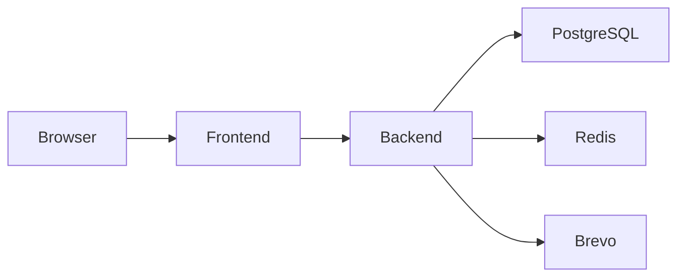
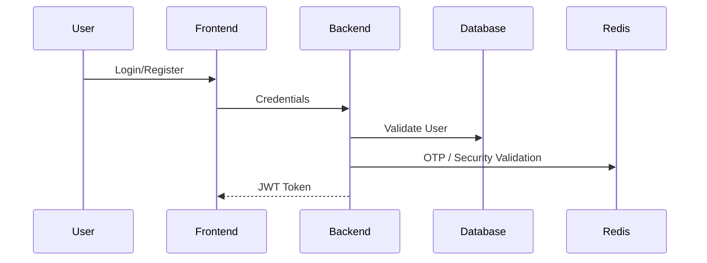
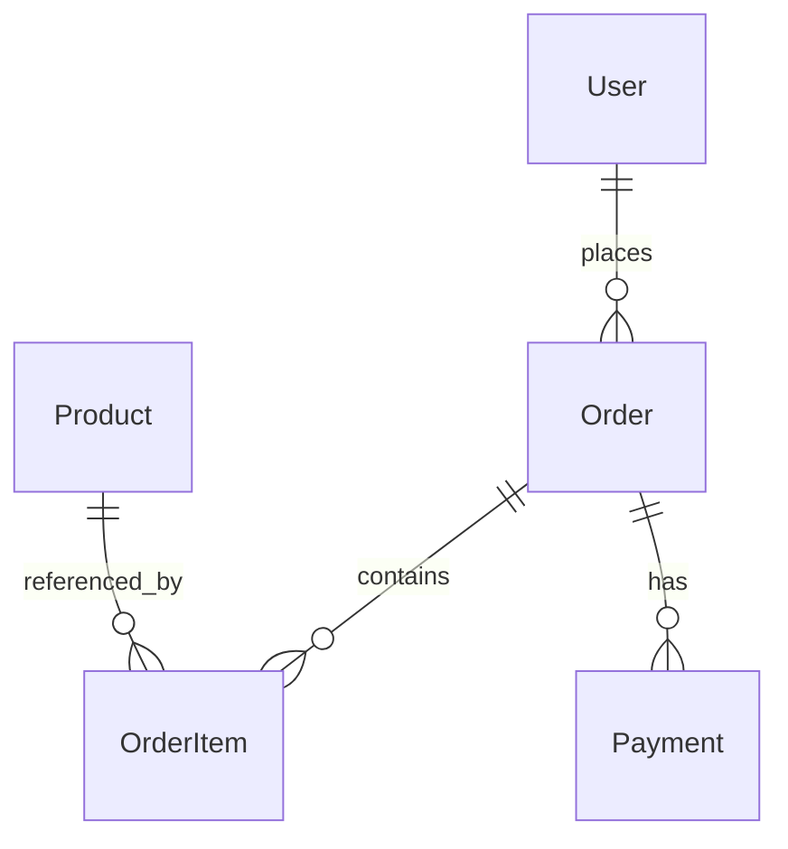

# SmartShop — Enterprise Full‑Stack E‑Commerce Platform

> Scalable full‑stack e‑commerce platform engineered using modern frontend, backend, database, authentication, payment, Redis security, and enterprise architecture practices.

---

# Overview

SmartShop is a production‑inspired monorepo e‑commerce platform designed to demonstrate real‑world engineering architecture, scalable backend systems, modern frontend development, transactional workflows, OTP security, and enterprise‑style modular design.

The platform combines:

- Next.js App Router frontend
- Express TypeScript backend
- PostgreSQL database
- Prisma ORM
- Redis‑based OTP & security workflows
- JWT authentication
- Payment abstraction layer
- Transactional email integration
- Order & return systems
- Deployment‑ready architecture

The project is intentionally structured to simulate enterprise engineering practices rather than a simple CRUD application.

---

# Tech Stack

## Frontend

| Technology | Purpose |
|---|---|
| Next.js 16 | Frontend framework |
| React 19 | UI rendering |
| TypeScript | Type safety |
| Tailwind CSS | Styling |
| Axios | API communication |
| Framer Motion | Animations |
| shadcn/ui | UI components |

## Backend

| Technology | Purpose |
|---|---|
| Express 5 | REST API |
| TypeScript | Backend development |
| Prisma | ORM |
| PostgreSQL | Database |
| JWT | Authentication |
| bcryptjs | Password hashing |
| multer | File uploads |

## Infrastructure

| Technology | Purpose |
|---|---|
| Upstash Redis | OTP & rate limiting |
| Brevo | Transactional email |
| Render | Backend hosting |
| Vercel | Frontend hosting |

---

# Monorepo Structure

```text
apps/
  backend/     # Express API + Prisma + Redis + Auth + Payments
  frontend/    # Next.js App Router frontend
```

## Backend Structure

```text
src/
  routes/
  controllers/
  services/
  middlewares/
  lib/
  prisma/
```

## Frontend Structure

```text
app/
components/
contexts/
lib/
config/
```

---

# Core Features

## Authentication & Security

- JWT authentication
- OTP verification system
- Password reset workflows
- Redis‑based rate limiting
- Login abuse prevention
- Secure password hashing

## Product System

- Product catalog
- Pagination
- Search & suggestions
- Category filtering
- Brand filtering

## Checkout & Payments

- Payment abstraction architecture
- Payment‑first checkout workflow
- Payment confirmation & polling
- Idempotency support
- Refund & cancellation flows

## Order Management

- Order creation
- Order tracking
- Order history
- Return & replacement requests
- Transactional order workflows

## User Features

- Profile management
- Avatar uploads
- Cart & wishlist systems
- Authentication persistence

---

# Architecture Overview



## Frontend Responsibilities

- UI rendering
- state management
- API orchestration
- checkout workflows
- token persistence

## Backend Responsibilities

- authentication
- business logic
- database operations
- payment workflows
- OTP security
- API validation

## Redis Responsibilities

- OTP storage
- request throttling
- attempt counting
- temporary verification sessions

---

# Authentication Flow



## Security Features

- JWT token validation
- bcrypt password hashing
- OTP verification
- Redis rate limiting
- brute-force protection
- protected routes

---

# Checkout & Payment Flow

The checkout architecture is intentionally defensive.

## Workflow

1. Create temporary order identifier
2. Start payment process
3. Confirm payment
4. Validate products
5. Create final order

## Benefits

- prevents invalid order creation
- improves transactional consistency
- reduces payment/order mismatch risk
- improves frontend resilience

---

# API Overview

| Module | Base Route |
|---|---|
| Auth | /api/auth |
| Products | /api/products |
| Orders | /api/orders |
| Payments | /api/payments |
| User | /api/user |

## Major APIs

### Auth

- register
- login
- verify OTP
- forgot password
- reset password

### Products

- product listing
- search
- categories
- brands
- pagination

### Orders

- create order
- order tracking
- cancel order
- return/replace

### Payments

- create payment
- confirm payment
- refund
- status polling

---

# Database Architecture

Core entities:

- User
- Product
- Order
- OrderItem
- Payment
- ReturnReplaceRequest



---

# Engineering Design Patterns

| Pattern | Purpose |
|---|---|
| Service Layer | Reusable business logic |
| Middleware Pattern | Request interception |
| Provider Pattern | Frontend state management |
| Modular Routing | API scalability |
| Payment Abstraction | Gateway isolation |

---

# Scalability Strategy

The project is structured for future enterprise expansion.

## Scalability Goals

- modular architecture
- service separation
- reusable business logic
- scalable database design
- future microservice readiness
- deployment flexibility

---

# Deployment

## Frontend

- Hosted on Vercel
- Uses `NEXT_PUBLIC_API_URL`

## Backend

- Hosted on Render
- Prisma migrations on deployment
- Redis + PostgreSQL integration

---

# Local Development

## Backend

```bash
cd apps/backend
npm install
npx prisma migrate dev
npm run dev
```

## Frontend

```bash
cd apps/frontend
npm install
npm run dev
```

---

# Known Technical Debt

## Current Drift Areas

- legacy SMTP env validation vs Brevo implementation
- mixed frontend API request styles
- placeholder Docker artifacts
- multiple Prisma singleton files

---

# Recruiter‑Focused Highlights

This project demonstrates:

- full‑stack engineering
- scalable architecture design
- Redis security workflows
- payment abstraction systems
- Prisma relational modeling
- enterprise modularization
- production deployment awareness
- transactional workflow design
- secure authentication systems

---

# Future Enhancements

- real payment gateway integration
- Docker & Kubernetes support
- centralized logging
- analytics dashboards
- AI recommendation systems
- microservice extraction
- cloud scaling improvements

---

# Conclusion

SmartShop is an enterprise‑style e‑commerce platform engineered to demonstrate modern full‑stack development, scalable backend architecture, secure authentication workflows, Redis‑based OTP systems, payment abstraction, relational database modeling, and production‑inspired engineering practices.

The project serves as:

- a full‑stack engineering showcase
- an enterprise architecture portfolio project
- a recruiter‑friendly system design demonstration
- a scalable foundation for future production expansion

